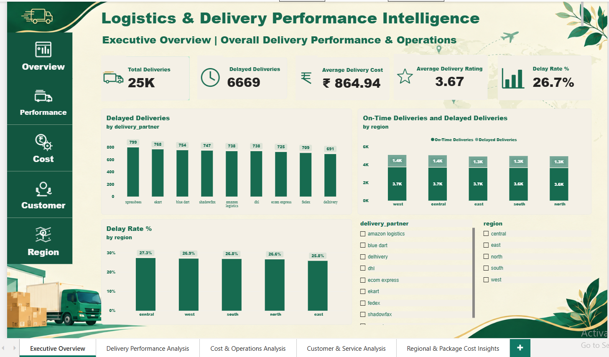
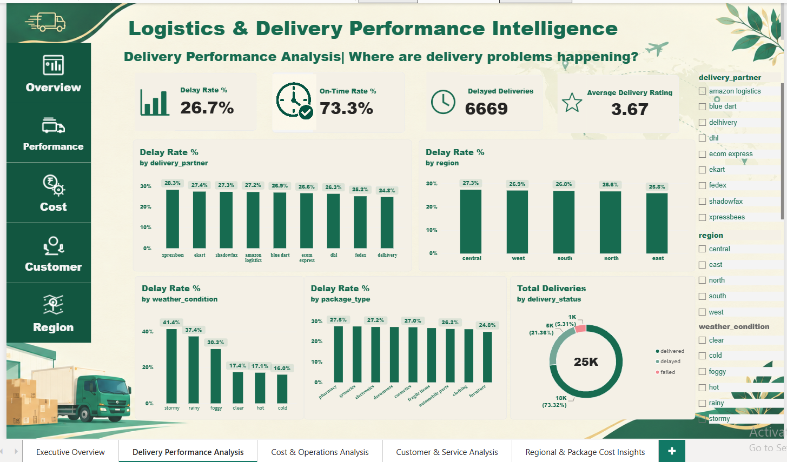
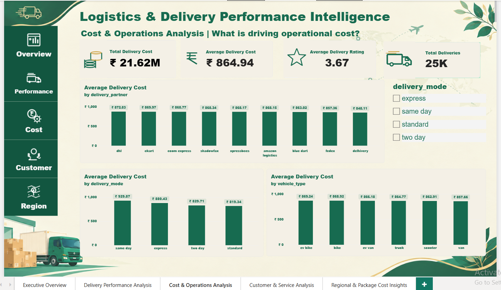
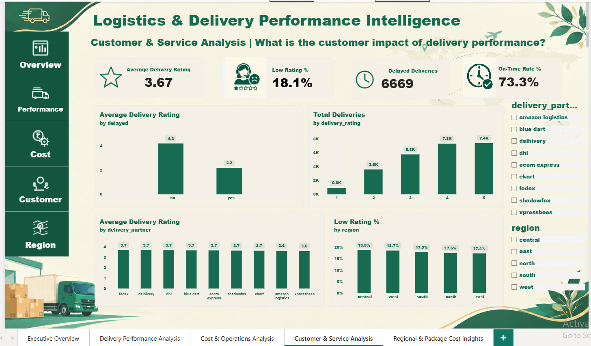
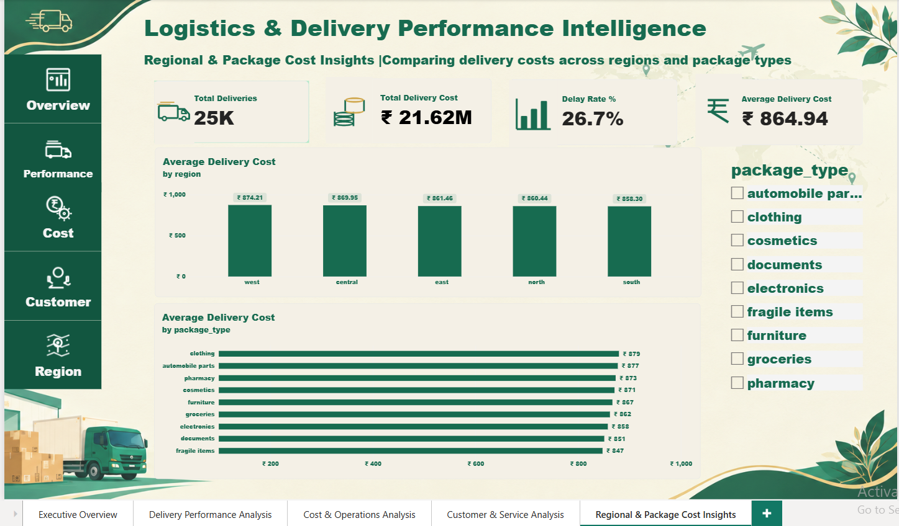

# Logistics & Delivery Performance Intelligence Dashboard
An Interactive Power BI Project for Logistics Analytics, Delivery Performance Monitoring, and Operational Cost Analysis
## Project Overview
The **Logistics & Delivery Performance Intelligence Dashboard** is a data analytics project developed using Microsoft Power BI to analyze delivery operations, monitor logistics performance, and understand factors affecting delivery delays, operational costs, and customer satisfaction.

The project explores a logistics dataset containing 25,000 delivery records across multiple delivery partners, regions, package types, vehicle types, and delivery modes.

The dashboard transforms raw logistics data into meaningful visual insights through interactive charts, KPI cards, filters, and DAX measures. It helps users explore delivery performance from different perspectives and identify areas that may require operational improvement.

The project is designed around three key business questions:

- How can delivery performance be monitored and improved?
- Which operational categories should be investigated to understand delivery costs?
- How can customer ratings be used to evaluate service quality?

## Dashboard Preview

### Page 1 – Executive Overview

### Page 2 – Delivery Performance Analysis

### Page 3 – Cost & Operations Analysis

### Page 4 – Customer & Service Analysis

### Page 5 – Regional & Package Cost Insights

  
## Project Objectives
- Analyze overall delivery performance using key performance indicators.
- Measure the proportion of delayed and on-time deliveries.
- Compare delivery performance across partners and regions.
- Explore delivery costs across vehicles, delivery modes, and package types.
- Understand customer satisfaction through delivery ratings.
- Identify patterns that may be associated with delivery delays.
- Present findings through an interactive and easy-to-understand dashboard.
- Support data-driven analysis of logistics operations.

## Tools & Technologies

| Tool | Purpose |
|---|---|
| Microsoft Excel | Data cleaning and preparation |
| Power BI | Dashboard creation and visualization |
| Power Query | Data transformation |
| DAX | Creating measures and KPIs |

## Dataset Description

The project uses a logistics delivery dataset obtained from Kaggle for data analysis and dashboard development.

The dataset contains approximately 25,000 delivery records representing logistics operations across multiple delivery partners, regions, package types, vehicle types, and delivery modes.

The data is used to demonstrate data preparation, KPI development, interactive visualization, and logistics performance analysis using Microsoft Power BI.

- **Dataset Name:** Delivery Logistics Dataset (India – Multi-Partner)
- **Dataset Type:** Logistics delivery data (origin not independently verified)
- **Number of Records:** Approximately 25,000
- **Number of Columns:** 15
- **Domain:** Logistics and Delivery Operations
- **File Format:** CSV
- **Dataset Source:** [Kaggle – Delivery Logistics Dataset](https://www.kaggle.com/datasets/muhammadahmaddaar/delivery-logistics-dataset-india-multi-partner)

## Key Dataset Fields

| **Column** | **Description** |
|---|---|
| `delivery_id` | Identifier associated with a delivery record |
| `delivery_partner` | Logistics partner handling the delivery |
| `package_type` | Category of the package |
| `vehicle_type` | Type of vehicle used |
| `delivery_mode` | Mode of delivery |
| `region` | Geographic region |
| `weather_condition` | Weather condition associated with the delivery |
| `distance_km` | Delivery distance in kilometres |
| `package_weight_kg` | Package weight in kilograms |
| `delivery_time_hours` | Recorded delivery time |
| `expected_time_hours` | Expected delivery time |
| `delayed` | Indicates whether a delivery was delayed |
| `delivery_status` | Delivery status |
| `delivery_rating` | Customer rating for the delivery |
| `delivery_cost` | Cost associated with the delivery |

The dataset was reviewed and prepared for analysis before being used to develop the Power BI report.

## Project Workflow

The project follows a structured data analytics workflow.

1. **Data Collection**  
   Obtained the logistics dataset containing delivery and operational information.

2. **Data Inspection**  
   Reviewed the dataset structure, column names, data types, and available values.

3. **Data Preparation**  
   Used Excel and Power Query to inspect and prepare the data for analysis.

4. **Data Validation**  
   Examined data quality, including duplicate delivery identifiers and field consistency.

5. **Data Modeling**  
   Loaded the prepared data into Power BI and organized the fields for reporting.

6. **DAX Measure Creation**  
   Created measures to calculate delivery counts, delay rates, on-time rates, delivery costs, and customer rating indicators.

7. **Dashboard Development**  
   Designed five report pages with KPI cards, charts, and interactive slicers.

8. **Performance Analysis**  
   Compared delivery performance, operational costs, and customer ratings across different categories.

9. **Insight Development**  
   Used the dashboard to identify important patterns and areas for further investigation.

## Dashboard Structure
The report is organized into five pages, with each page focusing on a specific area of logistics analysis.

### Page 1 – Executive Overview

Provides a high-level summary of logistics performance.

**Key Performance Indicators:**

- Total Deliveries
- Delayed Deliveries
- Average Delivery Cost
- Average Delivery Rating
- Delay Rate

**Analysis includes:**

- Delayed deliveries by delivery partner
- On-time and delayed deliveries by region
- Regional delay-rate comparisons

**Purpose:** To provide a quick overview of delivery performance and help users identify areas requiring closer attention.

### Page 2 – Delivery Performance Analysis

Examines delivery delays across different operational categories.

**Key Performance Indicators:**

- Delay Rate
- On-Time Rate
- Delayed Deliveries
- Average Delivery Rating

**Analysis includes:**

- Delay rate by delivery partner
- Delay rate by region
- Delay rate by weather condition
- Delay rate by package type
- A Donut chart for category distribution

**Purpose:** To explore how delivery performance varies across partners, regions, weather conditions, package types, and vehicles.

### Page 3 – Cost & Operations Analysis

Focuses on delivery expenditure and operational cost comparisons.

**Key Performance Indicators:**

- Total Delivery Cost
- Average Delivery Cost
- Average Delivery Rating
- Total Deliveries

**Analysis includes:**

- Average delivery cost by delivery partner
- Average delivery cost by vehicle type
- Average delivery cost by delivery mode

**Purpose:** To compare delivery costs across operational categories and identify areas for further cost analysis.

### Page 4 – Customer & Service Analysis

Explores customer ratings and service quality.

**Key Performance Indicators:**

- Average Delivery Rating
- Low Rating Percentage
- Delayed Deliveries
- On-Time Rate

**Analysis includes:**

- Average delivery rating by delay status
- Distribution of delivery ratings
- Average rating by delivery partner
- Low-rating percentage by region

**Purpose:** To understand customer rating patterns and examine how service performance varies across delivery categories.

### Page 5 – Regional & Package Cost Insights

Compares delivery costs across geographic regions and package categories.

**Key Performance Indicators:**

- Total Deliveries
- Total Delivery Cost
- Delay Rate
- Average Delivery Cost

**Analysis includes:**

- Average delivery cost by region
- Average delivery cost by package type

**Purpose:** To explore regional and package-level cost differences and support more detailed operational analysis.

## DAX Measures Used

DAX (Data Analysis Expressions) was used to create measures for calculating key logistics performance indicators.

| **Measure** | **Purpose** |
|---|---|
| **Total Deliveries** | Counts delivery records |
| **Delayed Deliveries** | Counts records marked as delayed |
| **On-Time Deliveries** | Counts records marked as not delayed |
| **Delay Rate %** | Calculates delayed deliveries as a percentage of total deliveries |
| **On-Time Rate %** | Calculates on-time deliveries as a percentage of total deliveries |
| **Average Delivery Cost** | Calculates the average delivery cost |
| **Total Delivery Cost** | Calculates the sum of delivery costs |
| **Average Delivery Rating** | Calculates the average customer rating |
| **Low Rating Deliveries** | Counts deliveries with a rating of 2 or below |
| **Low Rating %** | Calculates low-rating deliveries as a percentage of total deliveries |

## DAX Functions
- COUNTROWS() – Counts rows in a table.
- CALCULATE() – Evaluates an expression under specified filter conditions.
- DIVIDE() – Performs division with an optional alternate result when the denominator is zero.
- AVERAGE() – Calculates the arithmetic mean of a column.
- SUM() – Adds the values in a column.

These measures support consistent calculations across the dashboard and respond to the report's filter selections.

## Charts & Visualizations

The dashboard uses visualizations to communicate delivery performance and cost patterns.

| **Visualization** | **Analytical Purpose** |
|---|---|
| Clustered Column Chart | Compares values across categories |
| Stacked Column Chart | Shows the composition of delivery counts |
| Donut Chart | Shows the distribution of a selected category |
| KPI Cards | Highlight important performance indicators |

The charts are organized across the five report pages to support both high-level monitoring and detailed comparisons.

## Interactive Slicers

Slicers allow users to filter the report and explore selected parts of the dataset.

| **Slicer** | **Purpose** |
|---|---|
| Delivery Partner | Focuses analysis on a selected logistics partner |
| Region | Filters results by geographic region |
| Weather Condition | Explores delivery performance under selected weather conditions |
| Delivery Mode | Compares results for selected delivery modes |

The available slicers vary by report page. KPI cards and charts respond to applicable filter selections, allowing users to explore the data interactively.

## Key Performance Indicators & Findings

The current dashboard calculations provide the following summary of the dataset:

| **Metric** | **Current Result** |
|---|---:|
| Total Delivery Records | 25,000 |
| Delayed Deliveries | 6,669 |
| On-Time Deliveries | 18,331 |
| Delay Rate | 26.7% |
| On-Time Rate | 73.3% |
| Average Delivery Cost | ₹864.94 |
| Average Delivery Rating | 3.67 / 5 |

## Initial Observations

- Most delivery records are classified as on-time, while approximately 26.7% are marked as delayed.
- Delivery performance can be compared across partners and regions to identify differences in delay rates.
- Average delivery costs can be examined across delivery partners, vehicles, delivery modes, regions, and package types.
- Customer ratings provide an additional perspective on service quality.
- Low-rating deliveries can be examined by region and compared with other performance indicators.

These observations describe the current dataset. Further investigation would be needed to establish the causes of delays, cost differences, or customer rating patterns.

## Business Value

The dashboard provides a consolidated view of logistics operations and helps users:

- Monitor delivery performance through key metrics.
- Compare delivery partners and geographic regions.
- Examine operational cost differences.
- Explore customer satisfaction patterns.
- Identify categories that may require further investigation.
- Communicate logistics performance through interactive visual reports.

The dashboard supports analysis and decision-making; it does not by itself establish the causes of operational outcomes.

## Data Quality & Limitations
- The dataset contains repeated delivery identifiers. The records were retained for analysis, so the number of records should not automatically be interpreted as the number of unique deliveries.
- Some delivery-time fields presented data-type consistency challenges during preparation. These fields require additional validation before being used for detailed time-based analysis.
- The findings are based on the available dataset and should be interpreted within its scope.
- Relationships observed in the dashboard do not necessarily indicate causation.
- Dataset sharing will depend on permission to redistribute the source data.

## Future Enhancements
Potential improvements include:

- Investigating the causes of delivery delays in greater detail.
- Adding validated delivery-time and expected-time analysis.
- Developing additional cost-efficiency indicators.
- Exploring relationships between delivery delays and customer ratings.
- Adding more detailed time-based performance trends, if reliable date fields become available.
- Introducing predictive analytics for delivery-delay risk.
- Improving report navigation and adding further interactive features.
- Refreshing the dashboard with updated data when available.

## Conclusion
The Logistics & Delivery Performance Intelligence Dashboard demonstrates how Power BI, Power Query, and DAX can be used to transform logistics data into an interactive analytical report.

By bringing delivery performance, operational costs, and customer ratings together, the project provides a structured way to explore logistics operations across multiple dimensions.

The project also demonstrates practical skills in data preparation, KPI development, data visualization, and business-focused analysis.

## Author
Asmiya Farin S
